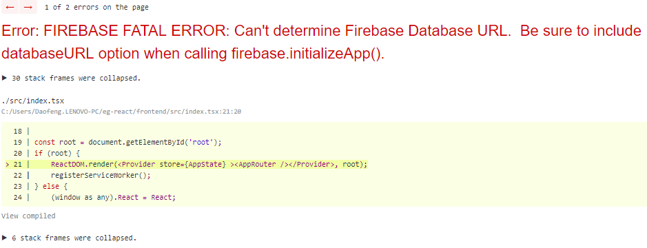
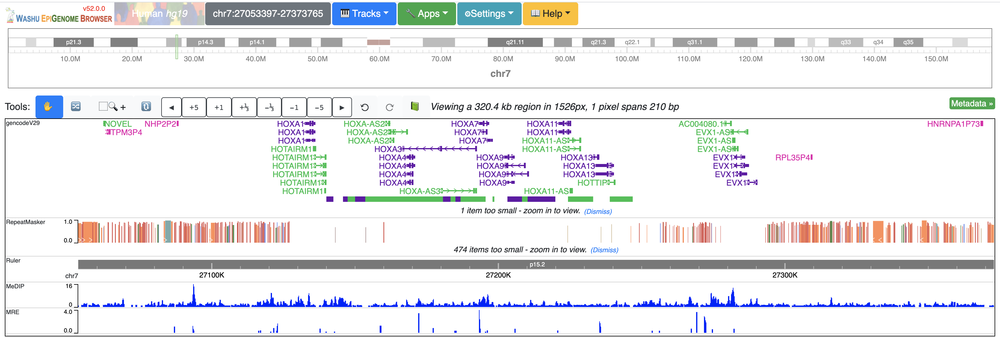

# FAQ

## Hard Reload

Sometimes your web browser might cached old Javascript code of the browser, if you didn\'t see updated feature after refresh, you can do a `Hard Reload`. This is how you do this on Google Chrome:

Open *Developer Tools*:

Click and Hold the Refresh button for a while, then you can see the *Hard Reload* option:

## Data fetch failed

Please check the URL to your file is correct. If yes, most case, your webserver doesn\'t enable CORS. Please see `tracks` page for how to enable CORS settings.

## Use HTTP or HTTPS

Both our main site and AWS mirror support both HTTP and HTTPS protocol, since webpage hosted through HTTPS cannot access resource hosted by HTTP, you should use our HTTP site. For example, when you visit [https://epigenomegateway.wustl.edu/browser](https://epigenomegateway.wustl.edu/browser), and you want to display a custome track hosted at `http://your.track.url.bigwig`, the browser will display `Data fetch failed` for that track because due to security settings, the browser in HTTPS page cannot access HTTP resource. In such case you can use [http://epigenomegateway.wustl.edu/browser](http://epigenomegateway.wustl.edu/browser) instead (without the `s`).

## Firebase fetal error

After you installed a new mirror, when you start your mirror instance by running `npm start`, if you see a Firebase fetal error like following:

This means you need to setup a Firebase database for the Session/Live function to work properly, check `Firebase_setup` please.

## Can I use without setup Firebase?

Yes. But this means you would not have the Session/Live function, check `use_without_Firebase` please.

## Local track security

Local track function is perfect for view protected or private data, since there is no data transfer on the web. More discussions about this please check [here](https://github.com/lidaof/eg-react/issues/114).

## What\'s the different between `hub` and `sessionFile` URL parameter

Both browser links with `hub` or `sessionFile` can be shared with others or be used for publication purpose. `sessionFile` not only contains all the *tracks* as `hub`, it also contains genomic coordinates, metadata, show/hide of genome navigator etc.

So `sessionFile` link contains more information than `hub` link, as the `sessionFile` contains more contents only used by the browser (it\'s much more complex than `hub` file syntax).

Examples links:

[hub link](https://epigenomegateway.wustl.edu/browser/?genome=hg19&hub=https://wangftp.wustl.edu/~dli/test/a.json)

[sessionFile link](https://epigenomegateway.wustl.edu/browser/?genome=hg19&sessionFile=https://wangftp.wustl.edu/~dli/test/eg-session-Hl4320IQ8-5b4bcd10-cbcd-11ea-b1b4-6196abf220ba.json)

