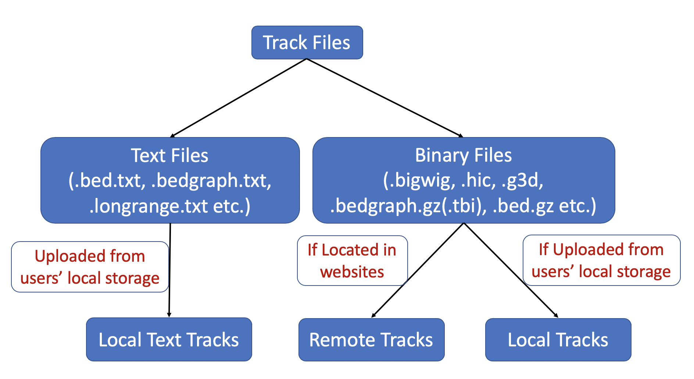
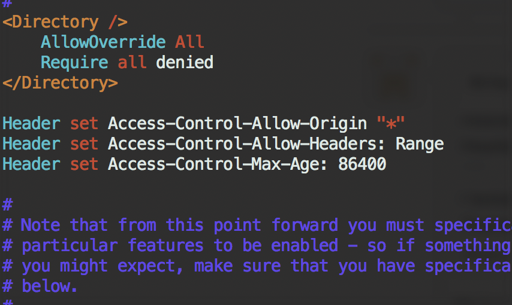
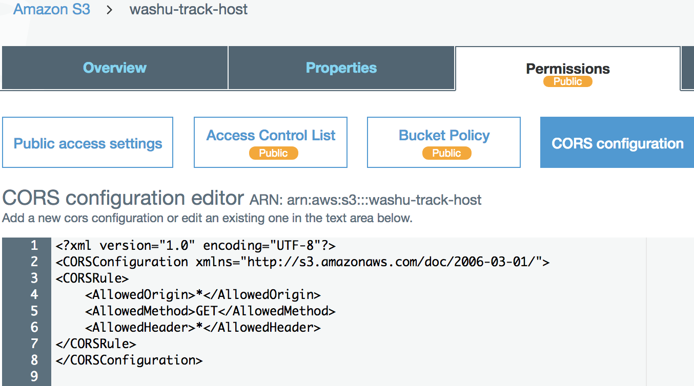
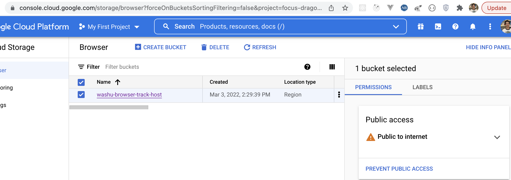
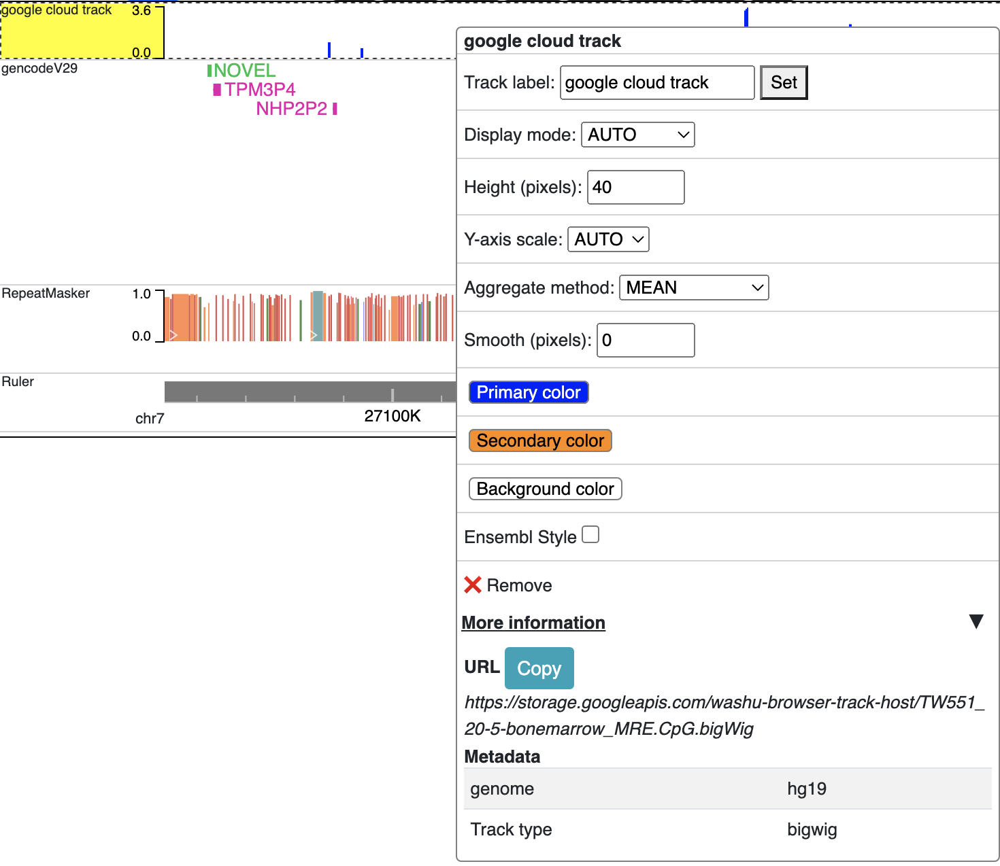
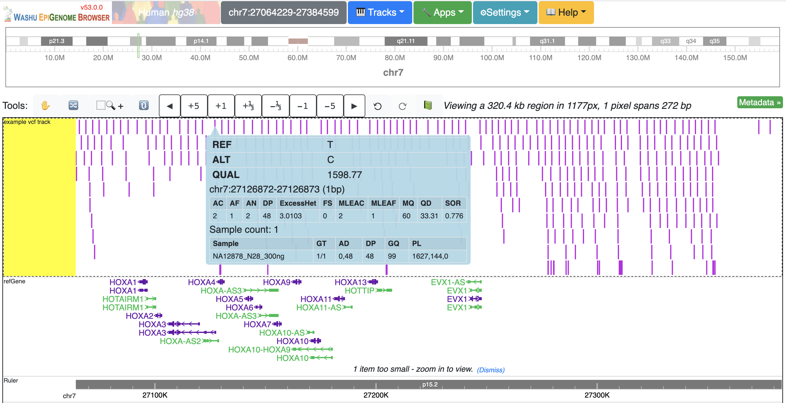
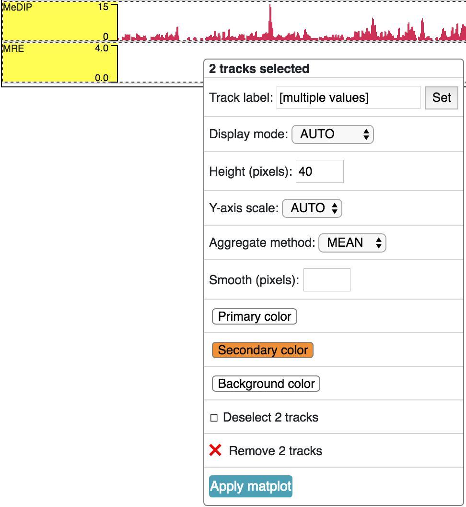
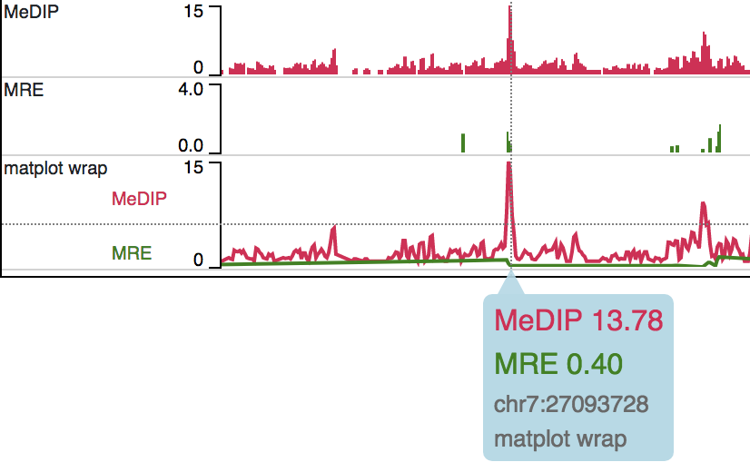
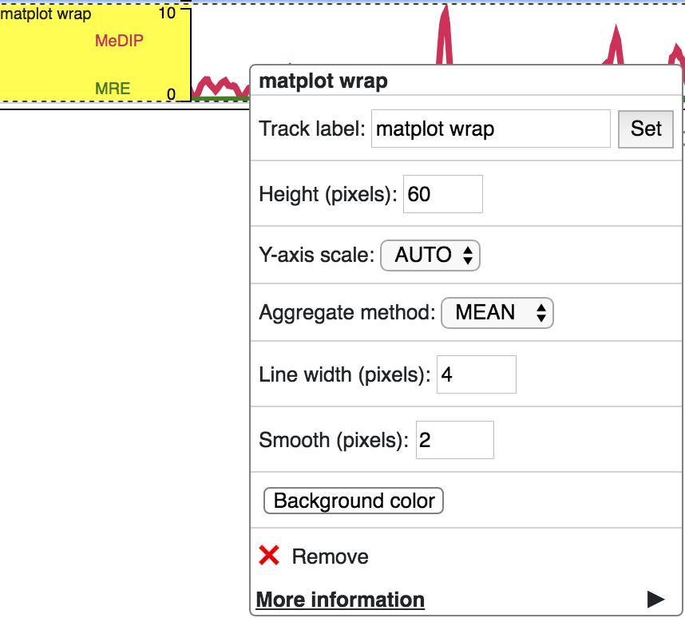

# File based tracks

**File-based tracks** in the **WashU Epigenome Browser** fetch data directly from files, either through **internal or external indexing mechanisms**. To enable smooth access, the **web server hosting these track files** must support **CORS (Cross-Origin Resource Sharing) policy** and allow **Byte Range Requests**, which are essential for efficiently retrieving only the required portions of large files.  

Most tracks in the Browser belong to this category, including **BigWig, BigBed, BAM, BED, and BedGraph**. File formats like **BigWig and BigBed** have built-in indexes, allowing efficient data access. Other formats, such as **BED and BedGraph**, require an **additional index file**—for example, a **Tabix index (.tbi) generated by the Tabix program** or a **BAM index (.bai) generated by Samtools**.  

Users can host **file-based tracks online** or **upload them from a local computer**. If uploading locally, the corresponding **index file must be uploaded simultaneously** to enable proper data retrieval and visualization.

## File based track groups

Track files are divided to 2 groups based on their file types, text format files and binary files like `bigWig` and `hic`. For binary track files, if the track files are located at websites, they are [Remote Tracks], if they are located in users\' computer then they are [Local Tracks]. For text track files, right now they can be uploaded from users\' computer, they are called [Local Text Tracks]. Please check the following diagram as well:



:::danger important

Since all remote tracks are hosted on the web with HTTP/HTTPS links provided for submission as tracks, the webservers which are hosting the track files need Cross-Origin Resource Sharing (CORS) enabled.

:::

Quoted from [MDN](https://developer.mozilla.org/en-US/docs/Web/HTTP/CORS):


> Cross-Origin Resource Sharing (CORS) is a mechanism that uses additional HTTP headers to tell a browser to let a web application running at one origin (domain) have permission to access selected resources from a server at a different origin. A web application makes cross-origin HTTP request when it requests a resource that has a different origin (domain, protocol, and port) than its own origin.


## Configure your webserver to enable CORS

Most likely the browser domain is different from the server the tracks are hosted on. The hosting server needs CORS enabled. For any Apache web server, you might try the either following approach.

### Enable CORS on Apache2 under Ubuntu

For an Apache web server in Ubuntu this setup (add this to the enabled .conf file) would work:

```sh
    Header always set Access-Control-Allow-Origin "*"
    Header always set Access-Control-Allow-Headers: Range
    Header always set Access-Control-Max-Age: 86400
```

Then restart your Apache server.

### Enable CORS on Apache2 under CentOS

Try add this to the main configuration file `/etc/httpd/conf/httpd.conf`:

```sh
    Header always set Access-Control-Allow-Origin "*"
    Header always set Access-Control-Allow-Headers: Range
    Header always set Access-Control-Max-Age: 86400
```



in `/etc/httpd/conf.modules.d/00-base.conf`, the header module should be enabled:


Then restart your Apache server.

### Enable CORS on Amazon S3 bucket

We have setup a test s3 bucket at `http://washu-track-host.s3-website-us-east-1.amazonaws.com` and tried [bigWig](#bigwig) files, the link `http://washu-track-host.s3-website-us-east-1.amazonaws.com/bigwig/TW551_20-5-bonemarrow_MRE.CpG.bigWig` can be displayed at the browser with following CORS setup:

```sh
[
    {
        "AllowedHeaders": [
            "*"
        ],
        "AllowedMethods": [
            "GET",
            "HEAD"
        ],
        "AllowedOrigins": [
            "*"
        ]
    }
]
```

If you happen to use old XML settings, you can setup it like this:

```xml
<?xml version="1.0" encoding="UTF-8"?>
<CORSConfiguration xmlns="http://s3.amazonaws.com/doc/2006-03-01/">
<CORSRule>
    <AllowedOrigin>*</AllowedOrigin>
    <AllowedMethod>GET</AllowedMethod>
    <AllowedHeader>*</AllowedHeader>
</CORSRule>
</CORSConfiguration>
```



### Enable CORS on Google cloud storage

If you have track files hotsed in Google cloud storage, they can be viewed in the browser as well after setting up correct CORS policy.

First you need make the bucket public, for more information you can check the [docs from google](https://cloud.google.com/storage/docs/access-control/making-data-public):



Then you can use either the [gsutil](https://cloud.google.com/storage/docs/quickstart-gsutil?cloudshell=true) tool or the CloudShell in your Google cloud\'s web console. Create a file called `cors.json` with contents below:

```json
[
    {
    "origin": ["*"],
    "method": ["GET", "HEAD"],
    "responseHeader": ["Authorization", "Content-Range", "Accept", "Content-Type", "Origin", "Range"],
    "maxAgeSeconds": 3600
    }
]
```

then set the CORS policy to your bucket with the command below:

```sh
    gsutil cors set cors.json gs://washu-browser-track-host
```

the screenshot below shows how I did in CloudShell in the console web page:


After this, you can copy the URL to the file and submit to the browser for visualization.



## Prepare track files

The browser accesses track files from their URL. Only a portion of the data, that within the specific view region, are transferred to the browser for visualization. Thus, all the track files need be hosted in a web accssible location using HTTP or HTTPS. The following sections introduce the track types that the browser supports.

Binary track file formats like [bigWig](#bigwig) and [HiC](#hic) can be used directly with the browser. [bedGraph](#bedgraph), [methylC](#methylc), [categorical](#categorical), [longrange](#longrange) and [bed](#bed) track files need to be [compressed by bgzip and indexed by tabix](http://www.htslib.org/doc/tabix.html) for use by the browser. The resulting index file with suffix `.tbi` needs to be located at the same URL with the `.gz` file.

Bed like format track files need be sorted before submission. For example, if we have a track file named `track.bedgraph` we can use the generic Linux `sort` command, the `bedSort` tool from UCSC, or the `sort-bed` command from BEDOPS. Here is an example command using each of the three methods:

```sh
    # Using Linux sort
    sort -k1,1 -k2,2n track.bedgraph > track.bedgraph.sorted
    # Using bedSort
    bedSort track.bedgraph track.bedgraph.sorted
    # Using sort-bed
    sort-bed track.bedgraph > track.bedgraph.sorted
```

Then the file must be compressed using bgzip and indexed using tabix:

```sh
    bgzip track.bedgraph.sorted
    tabix -p bed track.bedgraph.sorted.gz
```

Move files \"track.bedgraph.sorted.gz\" and \"track.bedgraph.sorted.gz.tbi\" to a web server. The two files must be in the same directory. Obtain the URL to \"track.bedgraph.sorted.gz\" for submission.

SAM files first need to be compressed to [BAM](#bam) files. [BAM](#bam) files need to be coordinate sorted and indexed for use by the browser. The resulting index file with suffix `.bai` needs be located at the same URL with the `.bam` file.

Here is an example command:

```sh
    # Using samtools view to convert to bam
    samtools view -Sb test.sam > test.bam
    # Using samtools sort to coordinate sort the file
    samtools sort test.bam > test.sorted.bam
    # Using samtools index
    samtools index test.sorted.bam
```

## Annotation Tracks

Annotation tracks represent genomic features or intervals across the genome. Popular examples include SNP files, CpG Island files, and blacklisted regions.

### bed

`bed` format files can be used to annotate elements across the genome or to represent reads from a sequencing experiment. For more about the bed format please check the [UCSC
bed](https://genome.ucsc.edu/FAQ/FAQformat.html#format1) page.

Example lines are below:

```sh
    chr9    3035610 3036180 Blacklist_155   .   +
    chr9    3036200 3036480 Blacklist_156   .   +
    chr9    3036420 3036660 Blacklist_157   .   +
```

Every line must consist of at least 3 fields separated by the `Tab` delimiter. The required fields from left to right are `chromosome`, `start position` (0-based), and `end position` (not included). A fourth (optional) column is reserved for the name of the interval and the sixth column (optional) is reserved for the strand. All other columns are ignored, but can be present in the file.


:::info note

The display of a bed file differs by how many columns are provided in the file (see image above). The simplest, 3 column, format just displays blocks for each interval. The four column format displays the name of each element over each interval. If the sixth column is provided in the file then `>>>` or `<<<` will be displayed over each interval to represent strand information.
:::

This format needs to be compressed by bgzip and indexed by tabix for submission as a track. See [Prepare track files](#prepare-track-files).

### bigbed

`bigbed` is a binary format of `bed` file. `bigbed` file can be submitted directly without bgzip/tabix processing. For more about the bed format please check the [UCSC bigbed](https://genome.ucsc.edu/goldenPath/help/bigBed.html) page.

### refbed

The `refbed` format files allows you to upload a custom gene annotation track. It is similar to the refGene bed-like file downloaded from UCSC but with slight modifications. Each file of this format contains (each column is separated by *Tab*):

> chr, transcript_start, transcript_stop, translation_start,
> translation_stop, strand, gene_name, transcript_id, type,
> exon(including UTR bases) starts, exon(including UTR bases) stops, and
> additional gene info (*optional*)

This format needs to be compressed by bgzip and indexed by tabix for submission as a track. See [Prepare track files](#prepare-track-files).

:::tip

The 9th column contains gene type, but is simplified from the Gencode/Ensembl annotations to coding, pseudo, nonCoding, problem, and
other. These classes of gene type are colored differently when the track is displayed on the browser.
:::

:::tip

The 10th and 11th columns contain exon starts and ends respectively. Each start or end is seperated by a comma.
:::

For example:

```sh
    start1,start2,start3,start4 stop1,stop2,stop3,stop4
    100,120,140,160 110,130,150,170
```

:::tip

The 12th column contains extra information. This information can be manually annotated or we suggest using [Ensembl
Biomart](http://useast.ensembl.org/biomart/martview/) to download paired Transcript stable IDs and Gene descriptions. The information in this column must be seperated by *spaces* and not tabs.
:::

All of the below lines will work for additional information in the 12th column:

```sh
    Gene ID:ENSMUSG00000103482.1 Gene Type:TEC Transcript Type:TEC Additional Info:predicted gene, 37999 [Source:MGI Symbol;Acc:MGI:5611227]
    Gene ID:ENSMUSG00000103482.1 Gene Type:TEC Transcript Type:TEC 
    ENSMUSG00000103482.1 TEC
    Additional Info:predicted gene, 37999 [Source:MGI Symbol;Acc:MGI:5611227]
    My Favorite Gene
```

Here are a few example lines in refbed format from gencode.vM17.annotation.gtf (mouse mm10 format):

```sh
    chr1    24910461    24911659    24910461    24911659    -   RP23-109H7.1    ENSMUST00000187022.1    pseudo  24911220,24910461   24911659,24910681   Gene       ID:ENSMUSG00000100808.1 Gene Type:processed_pseudogene Transcript Type:processed_pseudogene Additional Info:predicted gene 28594           [Source:MGI Symbol;Acc:MGI:5579300]
    chr1    25203443    25205696    25203443    25205696    -   Adgrb3  ENSMUST00000190202.1    coding  25203443    25205696    Gene                             ID:ENSMUSG00000033569.17 Gene Type:protein_coding Transcript Type:retained_intron Additional Info:adhesion G protein-coupled receptor     B3 [Source:MGI Symbol;Acc:MGI:2441837]
    chr1    25276404    25277954    25276404    25277954    -   RP23-21P2.4 ENSMUST00000193138.1    problem 25276404    25277954    Gene                         ID:ENSMUSG00000104257.1 Gene Type:TEC Transcript Type:TEC Additional Info:predicted gene, 20172 [Source:MGI Symbol;Acc:MGI:5012357]
    chr1    26566833    26566938    26566833    26566938    +   Gm24064 ENSMUST00000157486.1    nonCoding   26566833    26566938    Gene                           ID:ENSMUSG00000088111.1 Gene Type:snoRNA Transcript Type:snoRNA Additional Info:predicted gene, 24064 [Source:MGI                         Symbol;Acc:MGI:5453841]
```

:::info note

The last optional column is dislayed as a gene description when a gene is clicked on the browser. Our modified format can be easily obtained
from available refGene.bed file downloads from UCSC. Gencode GTF and Ensembl GTF files can be manipulated to this format using the
Converting_Gencode_or_Ensembl_GTF_to_refBed.bash script in [scripts](https://github.com/lidaof/eg-react/tree/master/backend/scripts). The script by default puts `Gene ID:`, `Gene Type:`, and `Transcript Type:` in the additional information column. Run with an annotation file, with columns Transcript_ID and Description (seperated
by a tab), the script will also add \"Additional Info\" to the 12th column. The script depends on bedtools, bgzip, and tabix. Lastly, within the script an `awk` array is used to reclassify gene type and can easily be modified for additional gene types.
:::

The script is run as follows:

```sh
    bash Converting_Gencode_or_Ensembl_GTF_to_refBed.bash Ensembl my.gtf my_optional_annotation.txt
    bash Converting_Gencode_or_Ensembl_GTF_to_refBed.bash Gencode gencode.vM17.annotation.gtf 
    bash Converting_Gencode_or_Ensembl_GTF_to_refBed.bash Gencode gencode.vM17.annotation.gtf biomart_2col.txt
```

:::danger important

Spaces are used as delimiters in the `GTF` files so change gene names
with spaces before processing.
:::

For Example:

```sh
    sed -i 's/ (1 of many)/_(1_of_many)/g' Danio_rerio.GRCz10.91.chr.gtf
```

### rgbpeak

`rgbpeak` track file is based on `bigbed` format, content of a `rgbpeak` file (in bed format) looks like below:

```sh
    chr10 46092019 46092519 chr10_46092019 537 . 46092019 46092519 117,117,117
    chr10 47253553 47254053 chr10_47253553 748 . 47253553 47254053 107,107,107
```

where the columns are

>`chrom, start, end, peak_id, score, strand, thick_start, thick_end, RGB value`,

the RBG value will be used for the color while ploting and score will be used to determin the height of the peak. if there is strand, arrow will
be drew if zoom enough. thick_start and thick_end columns are ignored now.

The bed file like above can be convert to bigbed format using the commands below:

```sh
    bedSort peaks_rgb.bed peaks_rgb.bed
    bedToBigBed peaks_rgb.bed hg38.chroms.sizes peaks_rgb.bigbed
```

### bedcolor

Simiar to [bed](#bed) track, `bedcolor` track is a 4 column bed file while the 4th column is a color string:

```sh
    chr11   108280000   109080000   #ff0100
    chr11   109080000   109480000   #0000ff
    chr11   109720000   110160000   #018100
    chr11   110200000   111400000   #0064fb
    chr11   111400000   112640000   #ef8c0a
    chr11   112640000   113480000   #7f007f
    chr11   113520000   114520000   #520000
    chr11   114520000   114880000   #39ae00
```

It can be uploaded as local text track, or indexed after bgzip/tabix and submitted as remote track.

## Variant Tracks

### VCF

`VCF` files can be visulaized in the browser for displaying variant call data. Currently VCF file need to be bgzip and tabix indexed for submission. The VCF track has 3 display modes: [auto], [density] and [full]. By default it\'s on [auto] mode, this means when viewing a `VCF` track at a region greater than 100Kb, the track will be displayed as numerical track showing the density of the variant calls, and when view region is less than or equal to 100Kb, it will be displayed in Full mode. The display mode can be changed from the right clicking menu. Click each of the variant item will show the popup tooltip with more information about this variant.



Color of each variant item are encoded based on the AF or quality value, using which value (AF or quality) to color the variant, or color of high and low value variant can be customized from right clicking menu as well.


## Numerical Tracks

Currently there are two types of numerical tracks:

- [bigWig](#bigwig)
- [bedGraph](#bedgraph)

### bigWig {#bigWig}

`bigWig` is a popular format to represent numerical values over genomic coordinates. Please check the [UCSC bigWig](https://genome.ucsc.edu/goldenpath/help/bigWig.html) page to learn  more about this format.

### bedGraph {#bedGraph}

`bedGraph` format also defines values in diffenent genomic locations. For more about the bedGraph format please check the [UCSC bedGraph](https://genome.ucsc.edu/goldenpath/help/bedgraph.html) page.

Example lines are below:

```sh
    chr12   6537598 6537599 28.80914
    chr12   6537599 6537600 28.96908
    chr12   6537599 6537612 -2
    chr12   6537600 6537601 29.30229
```

Every line consists of 4 fields separated by the `Tab` delimiter. The fields from left to right are `chromosome`, `start position` (0-based), `end position` (not included), and `value`. 

:::tip

You can use negative values for reverse strand. Both positive and negative values can exist over the same coordinates (they can overlap). In `bigWig` format negative values can also be specified, but they cannot overlap with positive values.
:::

This format needs to be compressed by bgzip and indexed by tabix for submission as a track. See [Prepare track files](#prepare-track-files).

## Dynamic Sequence Tracks

### dynseq

`dynseq` is a new track type which is proposed and initially developped by Surag Nair from Anshul Kundaje\'s lab at Stanford University. Its track file is the same as `bigWig` format. It provides scores for each nucleotide in the genome, which can be derived from using importance scoring methods on machine learning models. We visualize them as a string of letters with different colors (for each nucleotide) and different heights scaled by the importance scores.

An example of loaded `dynseq` track highlighting an E2F motif instance is illustrated below:


## Read Alignment BAM Tracks

### bam

The `bam` format is a compressed SAM format used to store sequence alignment data. Please check the [Samtools Documentation](https://samtools.github.io/hts-specs/SAMv1.pdf) page to learn more about this format and how to manipulate these files.

## Methylation Tracks

Methylation experiments like MeDIP-seq or MRE-seq can use [bigWig](#bigwig) or [bedGraph](#bedgraph) format for data display. For WGBS if users want to show read depth, methylation context, and methylation level then the data is best suited for the [methylC](#methylc) format, described below.

### methylC

Methylation data are formatted in `methylC` format, which is a 7 column bed format file:

```sh
    chr1    10542   10543   CG      0.923   -       26
    chr1    10556   10557   CHH     0.040   -       25
    chr1    10562   10563   CG      0.941   +       17
    chr1    10563   10564   CG      0.958   -       24
    chr1    10564   10565   CHG     0.056   +       18
    chr1    10566   10567   CHG     0.045   -       22
    chr1    10570   10571   CG      0.870   +       23
    chr1    10571   10572   CG      0.913   -       23
```

Each line contains 7 fields separated by Tab. The fields are `chromosome`, `start position` (0-based), `end position` (not included), `methylation context` (CG, CHG, CHG etc.), `methylation value`, `strand`, and `read depth`.

This format needs to be compressed by bgzip and indexed by tabix for submission as a track. See [Prepare track files](#prepare-track-files).

## Categorical Tracks

Categorical tracks represent genomic bins for different categories. The most popular example is the represnetation of chromHMM data which indicates which region is likely an enhancer, likely a promoter, etc. Other uses for the track include the display of different types of methylation (DMRs, DMVs, LMRs, UMRs, etc.) or even peaks colored by tissue type.

### categorical

The `categorical` track uses the first three columns of the standard [bed](#bed) format (`chromosome`, `start position` (0-based), and `end position` (not included)) with the addition of a 4th column indicating the category type which can be a string or number:

```sh
    chr1    start1  end1    category1
    chr2    start2  end2    category2
    chr3    start3  end3    category3
    chr4    start4  end4    category4
```

:::danger important

when you use numbers like 1, 2 and 3 as category names, in the datahub definition, please use it a string for the `category` attribute in options, see the example below:

``` json
{
    "type": "categorical",
    "name": "ChromHMM",
    "url": "https://egg.wustl.edu/d/hg19/E017_15_coreMarks_dense.gz",
    "options": {
        "category": {
            "1": {"name": "Active TSS", "color": "#ff0000"},
            "2": {"name": "Flanking Active TSS", "color": "#ff4500"},
            "3": {"name": "Transcr at gene 5' and 3'", "color": "#32cd32"}
        }
    }
}
```
:::

This format needs to be compressed by bgzip and indexed by tabix for submission as a track. See [Prepare track files](#prepare-track-files).

## Long range chromatin interaction

Long range chromatin interaction data are used to show relationships between genomic regions. [HiC](#hic) is used to show the results from a HiC experiment.

### HiC {#HiC}

To learn more about the HiC format please check [https://github.com/aidenlab/juicer/wiki/Data](https://github.com/aidenlab/juicer/wiki/Data).

### longrange

The `longrange` track is a [bed](#bed) format-like file type. Each row contains columns from left to right: `chromosome`, `start position` (0-based), and `end position` (not included), interaction target in this format `chr2:333-444,55`. As an example, interval \"chr1:111-222\" interacts with interval \"chr2:333-444\" on a score of 55, we will use following two lines to represent this interaction:

```sh
    chr1    111 222  chr2:333-444,55
    chr2    333 444  chr1:111-222,55
```

:::danger important

Be sure to make **TWO** records for a pair of interacting loci, one record for each locus.
:::

This format needs to be compressed by bgzip and indexed by tabix for submission as a track. See [Prepare track files](#prepare-track-files).

### bigInteract {#bigInteract}

The bigInteract format from UCSC can also be used at the browser, for more details about this format, please check the [UCSC bigInteract format](https://genome.ucsc.edu/goldenPath/help/interact.html) page.

## qBED Track

qBED is tab-delimited, plain text format for discrete genomic data, such as transposon insertions. This format requires a minimum of four columns and supports up to six. The four required columns are CHROM, START, END, and VALUE, where VALUE is a numeric value (i.e. an int or float). As with BED files, the START and END coordinates are 0-indexed. The fifth and sixth columns are optional and represent STRAND and ANNOTATION, respectively. The ANNOTATION column can be used to store sample- or entry- specific information, such as a replicate barcode. Here is an example of a four-column qBED file:

```sh
    chr1    41954321        41954325        1
    chr1    41954321        41954325        18
    chr1    52655214        52655218        1
    chr1    52655214        52655218        1
    chr1    54690384        54690388        3
    chr1    54713998        54714002        1
    chr1    54713998        54714002        1
    chr1    54713998        54714002        13
    chr1    54747055        54747059        1
    chr1    54747055        54747059        4
    chr1    60748489        60748493        2
```

Here is an example of a six-column qBED file:

```sh
    chr1    51441754        51441758        1       -       CTAGAGACTGGC
    chr1    51441754        51441758        21      -       CTTTCCTCCCCA
    chr1    51982564        51982568        3       +       CGCGATCGCGAC
    chr1    52196476        52196480        1       +       AGAATATCTTCA
    chr1    52341019        52341023        1       +       TACGAAACACTA
    chr1    59951043        59951047        1       +       ACAAGACCCCAA
    chr1    59951043        59951047        1       +       ACAAGAGAGACT
    chr1    61106283        61106287        1       -       ATGCACTACTTC
    chr1    61106283        61106287        7       -       CGTTTTTCACCT
    chr1    61542006        61542010        1       -       CTGAGAGACTGG
```

Your text file must be sorted by the first three columns. If your filename is example.qbed, you can sort it with the following command:

>`sort -k1V -k2n -k3n example.qbed > example_sorted.qbed` 

Alternatively, with `bedops`: 

>`sort-bed example.qbed > example_sorted.qbed`.

Note that you can have strand information without a barcode, but you cannot have barcode information without a strand column.

Place your sorted qBED file in a web-accessible directory, then compress and index as follows:

```sh
    bgzip example_sorted.qbed
    tabix -p bed example_sorted.qbed.gz
```

## genome-align Track

genome-align is tab-delimited, plain text BED-like format to display pairwise whole-genome alignment. It can be directly derived from AXT file. The four required columns are CHROM,  TART, END, and ALIGNMENT, where ALIGNMENT indicates id number and detailed alignment information in a JSON format :

```sh
    chr1    start   end alignment
```

The Fourth column ALIGNMENT contains the following information:

``` json
"id":1,
"genomealign": {
    "chr": "chr4",
    "start": 154100819,
    "stop": 154100880,
    "strand": "-",
    "targetseq": "ATTGGAGGAAAGATGAGTGAGAGCATCAACTTCTCTCACAACCTAGGCCAGTAAGTAGTGCTT",
    "queryseq":  "ATTGGAGGGAGGGTGAACAAAGAGATAGACTTCTG--GCAACCTGGGCCAGTAGGTAGTGTCT"
}

```

Here is an example of the genome-align track:

```json
    chr1    12177   12240   id:1,genomealign:{chr:"chr4",start:154100819,stop:154100880,strand:"-",targetseq:"ATTGGAGGAAAGATGAGTGAGAGCATCAACTTCTCTCACAACCTAGGCCAGTAAGTAGTGCTT",queryseq:"ATTGGAGGGAGGGTGAACAAAGAGATAGACTTCTG--GCAACCTGGGCCAGTAGGTAGTGTCT"}
    chr1    12245   12273   id:2,genomealign:{chr:"chr9",start:114130992,stop:114131016,strand:"+",targetseq:"CATCTCCTTGGCTGTGATACGTGGCCGG",queryseq:"TGTCCCCTTGTCTGC----CGGGGCTGG"}
```

AXT file can be generated by [lastz] or [blastz]. It is also possible to make genome alignment using minimap2, and sequentially convert minimap2 SAM output to AXT file. Here is our  pipeline making hg38-CHM13 genome-align AXT file:

```sh
    minimap2 -x asm5 --cs=long hg38.fa chm13.fa > hg38-chm13.paf
    sort -k6,6 -k8,8n -k9,9n hg38-chm13.paf|perl -ln unique_paf.pl > hg38-chm13.unique.paf
    paftools.js view -f maf hg38-chm13.unique.paf > hg38-chm13.maf
    maf-convert axt hg38-chm13.maf > hg38-chm13.axt
    python3 axtSplit.py 100 hg38-chm13.axt hg38-chm13.split.axt
```

Note we used two custom script [unique_paf.pl] and [axtSplit.py] to remove redundant segments in the alignment and split long alignment records to smaller ones separated by gaps \> 100bp. You can find them in the [scripts](https://github.com/lidaof/eg-react/tree/master/backend/scripts) directory: ([https://github.com/lidaof/eg-react/blob/master/backend/scripts](https://github.com/lidaof/eg-react/blob/master/backend/scripts)).

AT last, we have a script to convert AXT file to genome-align format, you can find it in the [scripts](https://github.com/lidaof/eg-react/tree/master/backend/scripts) directory: ([https://github.com/lidaof/eg-react/blob/master/backend/scripts/axt2align.py](https://github.com/lidaof/eg-react/blob/master/backend/scripts/axt2align.py)).

Your text file must be sorted by the first three columns. If your filename is example.qbed, you can sort it with the following command: 

>`sort -k1V -k2n -k3n example.genomealign > example.sorted.genomealign`

Place your sorted genome-align file in a web-accessible directory, then
compress and index as follows:

```sh
    bgzip example.sorted.genomealign
    tabix -p bed example.sorted.genomealign.gz
```

## Matplot Track

A matplot (also called a line plot) displays multiple numerical tracks on the same X and Y axes to easily compare datasets. Data is plotted as curves instead of bar plots.

To use matplot, choose more than 1 numerical tracks:



Right click, and choose *Apply matplot* button, The new matplot track will be shown:



and it also supports many configurations:


